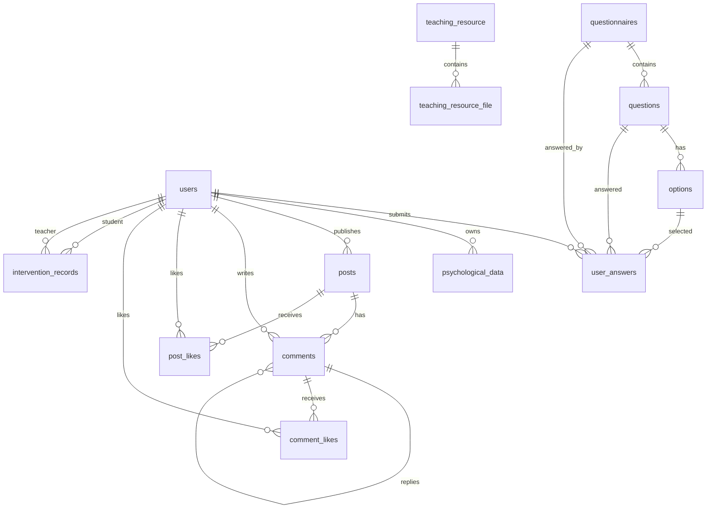

# 数据库设计与 E-R 关系说明

## 1. 数据库概述

本系统数据库名为 `magic_cube`，使用 MySQL 8.0。数据库主要服务于用户管理、心理问卷测评、心理能量数据、教师干预记录、班级论坛和教学资源管理等业务。

系统主要数据表如下：

| 序号 | 表名 | 中文含义 |
| --- | --- | --- |
| 1 | `users` | 用户表 |
| 2 | `questionnaires` | 问卷表 |
| 3 | `questions` | 问题表 |
| 4 | `options` | 选项表 |
| 5 | `user_answers` | 用户答题记录表 |
| 6 | `psychological_data` | 心理能量数据表 |
| 7 | `intervention_records` | 干预记录表 |
| 8 | `posts` | 论坛帖子表 |
| 9 | `comments` | 评论表 |
| 10 | `post_likes` | 帖子点赞表 |
| 11 | `comment_likes` | 评论点赞表 |
| 12 | `teaching_resource` | 教学资源课文表 |
| 13 | `teaching_resource_file` | 教学资源文件表 |

## 2. E-R 关系图

## 3. 主要实体关系说明

### 3.1 用户与角色

`users` 表保存系统所有用户，包括学生和管理员/教师。通过 `role` 字段区分角色：

- `student`：学生用户
- `admin`：管理员/教师用户

教师和学生通过 `class_id` 字段建立班级归属关系，教师端可查看同班级学生的心理能量数据。

### 3.2 问卷、题目、选项与答题记录

问卷模块由四类数据组成：

- 一个 `questionnaires` 问卷包含多个 `questions` 题目。
- 一个 `questions` 题目包含多个 `options` 选项。
- 学生提交问卷后，答案保存到 `user_answers`。
- `user_answers` 同时记录用户、问卷、题目、选项或量表分值。

该设计支持量表题、单选题、文本题等扩展形式。当前系统主要使用量表题记录心理弹性得分。

### 3.3 心理能量数据

`psychological_data` 表保存学生每次测评后的汇总得分，包括：

- 用户 ID
- 总分
- 测评日期
- 干预状态
- CD-RISC 得分
- 学生姓名、性别、年龄、年级快照

该表用于学生端能量趋势展示和教师端班级数据分析。

### 3.4 干预记录

`intervention_records` 表保存教师对学生的干预记录。每条记录关联：

- 一个学生 `student_id`
- 一个教师 `teacher_id`

记录内容包括干预标题、干预内容、干预类型和创建时间。该表用于体现“发现问题、记录干预、跟踪变化”的业务闭环。

### 3.5 班级论坛

论坛模块由帖子、评论和点赞组成：

- `posts` 保存帖子。
- `comments` 保存评论，支持通过 `parent_id` 实现回复。
- `post_likes` 保存帖子点赞记录。
- `comment_likes` 保存评论点赞记录。

通过 `user_id` 可追踪帖子和评论的发布者。管理员可以置顶重要帖子。

### 3.6 教学资源

教学资源模块由两张表组成：

- `teaching_resource`：表示一篇课文或一个资源主题。
- `teaching_resource_file`：表示该课文下的文件或文件夹。

`teaching_resource_file.parent_id` 用于支持多级文件夹结构。`file_type` 用于区分教案、教学建议、视频、普通文档、文件夹等类型。

## 4. 数据表设计

### 4.1 users 用户表

| 字段名 | 类型 | 是否为空 | 说明 |
| --- | --- | --- | --- |
| `id` | INT | 否 | 主键，自增 |
| `username` | VARCHAR(255) | 否 | 登录用户名，唯一 |
| `password` | VARCHAR(255) | 是 | 登录密码 |
| `class_id` | VARCHAR(255) | 是 | 班级编号 |
| `role` | VARCHAR(50) | 是 | 用户角色 |
| `gender` | VARCHAR(20) | 是 | 性别 |
| `age` | INT | 是 | 年龄 |
| `grade` | VARCHAR(50) | 是 | 年级 |
| `name` | VARCHAR(100) | 是 | 姓名 |
| `created_at` | DATETIME | 是 | 创建时间 |

### 4.2 questionnaires 问卷表

| 字段名 | 类型 | 是否为空 | 说明 |
| --- | --- | --- | --- |
| `id` | INT | 否 | 主键，自增 |
| `title` | VARCHAR(255) | 否 | 问卷标题 |
| `description` | VARCHAR(1000) | 是 | 问卷说明 |
| `created_at` | DATETIME | 是 | 创建时间 |

### 4.3 questions 问题表

| 字段名 | 类型 | 是否为空 | 说明 |
| --- | --- | --- | --- |
| `id` | INT | 否 | 主键，自增 |
| `questionnaire_id` | INT | 否 | 所属问卷 ID |
| `content` | VARCHAR(500) | 否 | 题目内容 |
| `question_type` | VARCHAR(50) | 否 | 题目类型 |
| `dimension` | VARCHAR(100) | 是 | 测评维度 |

### 4.4 options 选项表

| 字段名 | 类型 | 是否为空 | 说明 |
| --- | --- | --- | --- |
| `id` | INT | 否 | 主键，自增 |
| `question_id` | INT | 否 | 所属题目 ID |
| `content` | VARCHAR(200) | 否 | 选项文本 |
| `score_value` | INT | 是 | 选项分值 |

### 4.5 user_answers 用户答题记录表

| 字段名 | 类型 | 是否为空 | 说明 |
| --- | --- | --- | --- |
| `id` | INT | 否 | 主键，自增 |
| `user_id` | INT | 否 | 用户 ID |
| `questionnaire_id` | INT | 否 | 问卷 ID |
| `question_id` | INT | 否 | 题目 ID |
| `option_id` | INT | 是 | 选项 ID |
| `scale_score` | INT | 是 | 量表题分值 |
| `answer_text` | VARCHAR(1000) | 是 | 文本答案 |
| `submitted_at` | DATETIME | 是 | 提交时间 |
| `intervention_status` | VARCHAR(50) | 是 | 干预状态 |

### 4.6 psychological_data 心理能量数据表

| 字段名 | 类型 | 是否为空 | 说明 |
| --- | --- | --- | --- |
| `id` | INT | 否 | 主键，自增 |
| `user_id` | INT | 否 | 用户 ID |
| `score` | INT | 否 | 总分 |
| `test_date` | DATE | 否 | 测评日期 |
| `anxiety_level` | INT | 是 | 焦虑水平 |
| `motivation_level` | INT | 是 | 动机水平 |
| `focus_level` | INT | 是 | 专注水平 |
| `intervention_status` | VARCHAR(50) | 是 | 干预前/干预后 |
| `cd_risc_score` | INT | 是 | CD-RISC 得分 |
| `student_name` | VARCHAR(100) | 是 | 学生姓名快照 |
| `student_gender` | VARCHAR(20) | 是 | 学生性别快照 |
| `student_age` | INT | 是 | 学生年龄快照 |
| `student_grade` | VARCHAR(50) | 是 | 学生年级快照 |
| `created_at` | DATETIME | 是 | 创建时间 |

### 4.7 intervention_records 干预记录表

| 字段名 | 类型 | 是否为空 | 说明 |
| --- | --- | --- | --- |
| `id` | INT | 否 | 主键，自增 |
| `student_id` | INT | 否 | 学生 ID |
| `teacher_id` | INT | 否 | 教师 ID |
| `student_name` | VARCHAR(100) | 是 | 学生姓名 |
| `teacher_name` | VARCHAR(100) | 是 | 教师姓名 |
| `title` | VARCHAR(255) | 是 | 干预标题 |
| `content` | VARCHAR(2000) | 是 | 干预内容 |
| `intervention_type` | VARCHAR(100) | 是 | 干预类型 |
| `created_at` | DATETIME | 是 | 创建时间 |

### 4.8 posts 帖子表

| 字段名 | 类型 | 是否为空 | 说明 |
| --- | --- | --- | --- |
| `id` | INT | 否 | 主键，自增 |
| `user_id` | INT | 否 | 发帖用户 ID |
| `content` | VARCHAR(1000) | 否 | 帖子内容 |
| `likes` | INT | 是 | 点赞数 |
| `created_at` | DATETIME | 是 | 发布时间 |
| `is_pinned` | BOOLEAN | 是 | 是否置顶 |

### 4.9 comments 评论表

| 字段名 | 类型 | 是否为空 | 说明 |
| --- | --- | --- | --- |
| `id` | INT | 否 | 主键，自增 |
| `post_id` | INT | 否 | 所属帖子 ID |
| `user_id` | INT | 否 | 评论用户 ID |
| `content` | VARCHAR(500) | 否 | 评论内容 |
| `parent_id` | INT | 是 | 父评论 ID |
| `created_at` | DATETIME | 是 | 评论时间 |

### 4.10 post_likes 帖子点赞表

| 字段名 | 类型 | 是否为空 | 说明 |
| --- | --- | --- | --- |
| `id` | INT | 否 | 主键，自增 |
| `post_id` | INT | 否 | 帖子 ID |
| `user_id` | INT | 否 | 点赞用户 ID |
| `created_at` | DATETIME | 是 | 点赞时间 |

### 4.11 comment_likes 评论点赞表

| 字段名 | 类型 | 是否为空 | 说明 |
| --- | --- | --- | --- |
| `id` | INT | 否 | 主键，自增 |
| `comment_id` | INT | 否 | 评论 ID |
| `user_id` | INT | 否 | 点赞用户 ID |
| `created_at` | DATETIME | 是 | 点赞时间 |

### 4.12 teaching_resource 教学资源表

| 字段名 | 类型 | 是否为空 | 说明 |
| --- | --- | --- | --- |
| `id` | INT | 否 | 主键，自增 |
| `title` | VARCHAR(200) | 否 | 课文标题 |
| `folder_name` | VARCHAR(200) | 是 | 对应文件夹名 |
| `sort_order` | INT | 是 | 排序值 |
| `created_at` | DATETIME | 是 | 创建时间 |

### 4.13 teaching_resource_file 教学资源文件表

| 字段名 | 类型 | 是否为空 | 说明 |
| --- | --- | --- | --- |
| `id` | INT | 否 | 主键，自增 |
| `resource_id` | INT | 否 | 所属教学资源 ID |
| `file_name` | VARCHAR(200) | 否 | 文件名 |
| `file_type` | VARCHAR(50) | 否 | 文件类型 |
| `file_path` | VARCHAR(500) | 否 | 文件路径 |
| `file_size` | BIGINT | 是 | 文件大小 |
| `description` | VARCHAR(500) | 是 | 文件说明 |
| `sort_order` | INT | 是 | 排序值 |
| `created_at` | DATETIME | 是 | 创建时间 |
| `parent_id` | INT | 是 | 父文件夹 ID |

## 5. 数据完整性设计

1. 用户名使用唯一约束，避免重复注册。
2. 问卷、题目、选项之间使用外键维护层级关系。
3. 用户答题记录关联用户、问卷、题目和选项，便于追溯每次答题明细。
4. 心理能量数据关联用户，用于个人趋势和班级统计。
5. 干预记录同时关联学生和教师，保证记录来源明确。
6. 论坛帖子、评论和点赞均关联用户，支持权限判断和操作追踪。
7. 教学资源文件关联教学资源主题，并通过 `parent_id` 支持文件夹层级。

## 6. 数据库设计特点

- 表数量满足课程要求，超过 4 张数据表。
- 业务表之间存在明确关联关系。
- 支持学生端、教师端和资源管理等多个业务模块。
- 支持核心业务流程：学生测评、生成心理数据、教师查看数据、记录干预。
- 支持论坛互动和教学资源管理，增强系统完整性。
