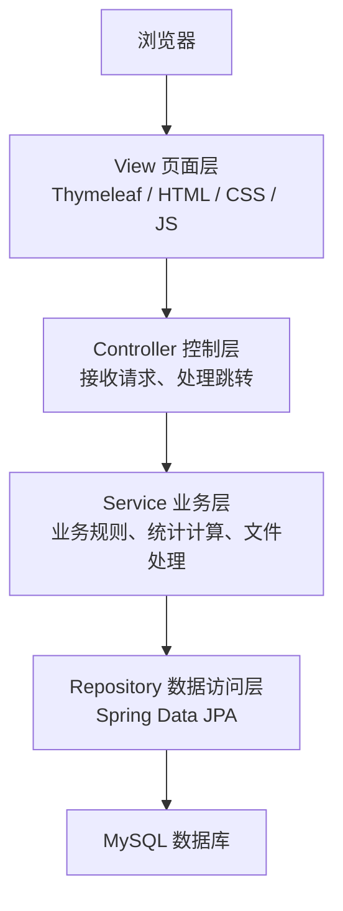
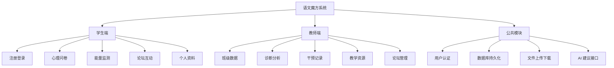

# 《Java Web应用开发》综合实践作品报告

## 项目名称

“语文魔方”学生心理能量监测与教学资源管理系统

## 小组信息

| 项目 | 内容 |
| --- | --- |
| 课程名称 | Java Web 应用开发 |
| 项目名称 | “语文魔方”学生心理能量监测与教学资源管理系统 |
| 小组编号 | 待填写 |
| 组长 | 待填写 |
| 成员 | 待填写 |
| 指导教师 | 待填写 |
| 完成日期 | 2026 年 6 月 |

---

# 第 1 章 项目概述

## 1.1 项目背景

随着校园信息化建设的推进，教师在日常教学中不仅需要管理教学资源，也需要关注学生的学习状态和心理健康情况。传统的线下问卷、纸质记录和人工统计方式效率较低，难以及时形成学生心理能量变化趋势，也不便于教师进行后续干预和跟踪。

本项目设计并实现“语文魔方”学生心理能量监测与教学资源管理系统。系统以语文教学场景为基础，结合心理问卷测评、班级数据分析、干预记录和教学资源管理，为学生提供心理测评、个人趋势查看和班级论坛交流功能，为教师提供班级心理能量监测、学生干预记录和教学资源管理功能。

## 1.2 项目目标

本系统主要实现以下目标：

1. 为学生提供注册、登录、个人资料维护和密码修改功能。
2. 为学生提供心理问卷测评功能，测评后生成心理能量得分。
3. 为学生提供个人心理能量监测页面，展示最新得分、历史记录和干预前后对比。
4. 为教师提供班级心理能量数据查看、统计分析和学生诊断功能。
5. 为教师提供学生干预记录管理功能，便于跟踪学生心理状态变化。
6. 提供班级论坛功能，支持学生和教师进行留言、评论和点赞互动。
7. 提供教学资源管理功能，支持教师查看、上传和下载语文教学资源。
8. 使用数据库保存用户、问卷、答题记录、心理数据、论坛和教学资源等信息。
9. 体现 MVC 分层思想，提高系统的可维护性和可扩展性。

## 1.3 开发环境

| 项目 | 内容 |
| --- | --- |
| 操作系统 | Windows 10/11 |
| JDK | JDK 17 |
| 数据库 | MySQL 8.0 |
| 开发工具 | IntelliJ IDEA |
| 构建工具 | Maven |
| 浏览器 | Chrome / Edge |
| 后端技术 | Spring Boot、Spring MVC、Spring Data JPA |
| 页面技术 | HTML、CSS、JavaScript、Thymeleaf |
| 数据库访问 | Spring Data JPA |
| 服务器 | Spring Boot 内置 Web 容器 |

说明：课程推荐技术组合为 JSP、Servlet、JavaBean、DAO、Service、JDBC 和 Tomcat。本项目采用 Spring Boot 技术路线实现 Java Web 应用，其中 Controller 承担请求处理职责，Entity 承担 JavaBean 实体职责，Repository 承担数据访问职责，Service 承担业务逻辑职责，Thymeleaf 页面承担视图展示职责。

---

# 第 2 章 需求分析

## 2.1 用户角色分析

系统主要包括两类用户角色：

| 用户角色 | 功能描述 |
| --- | --- |
| 学生 | 注册、登录、填写心理问卷、查看个人心理能量数据、参与论坛互动、修改个人资料 |
| 管理员/教师 | 查看班级心理能量数据、查看学生诊断信息、管理干预记录、管理教学资源、论坛置顶和管理 |

## 2.2 功能需求分析

| 模块 | 功能说明 |
| --- | --- |
| 用户模块 | 用户注册、登录、退出、记住用户名、个人资料修改、密码修改 |
| 问卷模块 | 问卷列表、开始问卷、提交答案、保存答题记录、计算测评分数 |
| 能量监测模块 | 学生查看最新得分、历史记录、干预前后对比、趋势数据 |
| 教师数据模块 | 教师查看班级学生测评数据、分数分布、班级干预前后对比 |
| 诊断模块 | 根据学生得分和状态生成分析建议，辅助教师了解学生情况 |
| 干预记录模块 | 教师新增、查看和删除学生干预记录 |
| 论坛模块 | 发帖、评论、回复、点赞、评论点赞、帖子置顶、删除 |
| 教学资源模块 | 查看课文资源、进入文件夹、上传文件、下载文件、删除文件或文件夹 |
| 词云模块 | 根据论坛或文本内容生成词云数据接口 |

## 2.3 非功能需求

| 类型 | 需求说明 |
| --- | --- |
| 易用性 | 页面结构清晰，学生和教师可通过首页导航进入主要功能 |
| 安全性 | 通过登录状态和角色字段区分学生与教师权限 |
| 可维护性 | 按 Controller、Service、Repository、Entity、Template 分层组织代码 |
| 数据完整性 | 使用 MySQL 持久化保存用户、问卷、答题、心理数据和资源数据 |
| 稳定性 | 核心功能可通过测试账号完整演示 |
| 可扩展性 | 问卷、教学资源和论坛模块均可继续扩展 |

---

# 第 3 章 系统设计

## 3.1 系统总体架构

本系统采用 MVC 分层思想，整体结构如下：



各层职责如下：

| 层次 | 主要职责 |
| --- | --- |
| View 层 | 页面展示、表单提交、用户交互 |
| Controller 层 | 接收请求、校验登录状态、调用业务层、返回页面或 JSON |
| Service 层 | 处理业务逻辑，如问卷初始化、答题保存、心理数据统计、文件处理 |
| Repository 层 | 操作数据库，完成实体的增删改查 |
| Entity 层 | 定义数据库实体和字段映射 |

## 3.2 系统功能模块设计



## 3.3 核心业务流程

### 3.3.1 学生心理测评流程


### 3.3.2 教师干预流程


### 3.3.3 教学资源管理流程


---

# 第 4 章 数据库设计

## 4.1 数据库概念结构设计

本系统主要实体包括用户、问卷、题目、选项、答题记录、心理能量数据、干预记录、帖子、评论、点赞、教学资源和资源文件。

主要关系如下：

1. 一个用户可以提交多条答题记录。
2. 一个用户可以拥有多条心理能量数据。
3. 一个问卷包含多个题目。
4. 一个题目包含多个选项。
5. 一个教师可以为多个学生添加干预记录。
6. 一个学生可以拥有多条干预记录。
7. 一个用户可以发布多个帖子和评论。
8. 一个帖子可以拥有多条评论和多个点赞。
9. 一个教学资源可以包含多个文件或文件夹。

## 4.2 数据表设计

数据库共设计 13 张主要数据表：

| 表名 | 作用 |
| --- | --- |
| `users` | 保存学生和教师账号信息 |
| `questionnaires` | 保存问卷基本信息 |
| `questions` | 保存问卷题目 |
| `options` | 保存题目选项 |
| `user_answers` | 保存用户答题记录 |
| `psychological_data` | 保存心理能量汇总数据 |
| `intervention_records` | 保存教师干预记录 |
| `posts` | 保存论坛帖子 |
| `comments` | 保存论坛评论 |
| `post_likes` | 保存帖子点赞 |
| `comment_likes` | 保存评论点赞 |
| `teaching_resource` | 保存教学资源主题 |
| `teaching_resource_file` | 保存教学资源文件和文件夹 |

详细字段和 E-R 关系见：

```text
submission-materials/docs/数据库设计与ER关系说明.md
```

数据库建表和初始化数据脚本见：

```text
submission-materials/database/magic_cube.sql
```

---

# 第 5 章 详细设计与实现

## 5.1 项目包结构

```text
com.yuwen.magiccube
├── config
│   ├── AsyncConfig.java
│   └── DeepSeekConfig.java
├── controller
│   ├── HomeController.java
│   ├── QuestionnaireController.java
│   ├── EnergyController.java
│   ├── DiagnosisController.java
│   ├── InterventionRecordController.java
│   ├── PostController.java
│   ├── TeachingResourceController.java
│   └── WordCloudController.java
├── entity
│   ├── User.java
│   ├── Questionnaire.java
│   ├── Question.java
│   ├── Option.java
│   ├── UserAnswer.java
│   ├── PsychologicalData.java
│   ├── InterventionRecord.java
│   ├── Post.java
│   ├── Comment.java
│   ├── TeachingResource.java
│   └── TeachingResourceFile.java
├── repository
│   └── 各实体 Repository 接口
├── service
│   └── 用户、问卷、心理数据、论坛、教学资源等业务类
└── utils
    └── WordCloudUtil.java
```

页面文件位于：

```text
src/main/resources/templates
```

静态资源位于：

```text
src/main/resources/static
```

## 5.2 核心类说明

| 类名 | 所在包 | 主要作用 |
| --- | --- | --- |
| `MagicCubeApplication` | `com.yuwen.magiccube` | 项目启动类 |
| `HomeController` | `controller` | 处理首页、登录、注册、个人资料和密码修改 |
| `QuestionnaireController` | `controller` | 处理问卷列表、答题、提交和结果查看 |
| `EnergyController` | `controller` | 处理学生能量监测和教师端班级数据 |
| `DiagnosisController` | `controller` | 处理个人和班级诊断分析 |
| `InterventionRecordController` | `controller` | 处理干预记录的增删查 |
| `PostController` | `controller` | 处理论坛帖子、评论、点赞和置顶 |
| `TeachingResourceController` | `controller` | 处理教学资源查看、上传、下载和删除 |
| `UserService` | `service` | 用户登录、注册、资料修改等业务 |
| `QuestionnaireService` | `service` | 问卷初始化、答题保存、得分计算 |
| `PsychologicalDataService` | `service` | 心理能量数据统计和查询 |
| `PostService` | `service` | 论坛帖子、评论和点赞业务 |
| `TeachingResourceService` | `service` | 教学资源文件扫描、上传、删除 |
| `DeepSeekServiceImpl` | `service.impl` | 调用 AI 接口生成心理建议 |

## 5.3 核心功能实现说明

### 5.3.1 登录注册功能

用户通过登录页面输入用户名和密码。Controller 接收请求后调用 `UserService.login` 查询数据库并验证密码。登录成功后，系统将用户对象保存到 Session 中，后续页面通过 Session 判断当前登录用户。

注册时，系统检查用户名是否已存在、密码长度是否符合要求，然后保存用户信息。注册成功后自动登录。

### 5.3.2 心理问卷功能

问卷功能由 `QuestionnaireController` 和 `QuestionnaireService` 实现。学生进入问卷页面后，系统加载问卷、题目和选项。提交后，系统解析题目分值，保存到 `user_answers` 表，并计算总分保存到 `psychological_data` 表。

该流程保证了既能查看单次汇总结果，也能追溯具体题目的答题情况。

### 5.3.3 能量监测功能

学生端能量监测页面读取当前用户的最新心理数据和历史数据，展示总分、常模范围、历史趋势和干预前后对比。教师端页面根据教师所在班级筛选学生数据，展示班级测评结果和统计信息。

### 5.3.4 干预记录功能

教师可以针对学生添加干预记录，内容包括干预标题、干预类型、干预内容、学生姓名和教师姓名。系统将记录保存到 `intervention_records` 表，便于后续跟踪。

### 5.3.5 论坛功能

论坛模块支持用户发帖、评论、回复、点赞和评论点赞。帖子可以按时间或点赞数排序，管理员可以置顶重要帖子。该功能增强了班级互动和学生表达渠道。

### 5.3.6 教学资源功能

教师可以进入教学资源模块，查看课文资源目录和文件。系统支持文件夹层级、文件上传、文件下载和删除。教学资源记录保存在数据库中，实际文件保存在静态资源目录下。

---

# 第 6 章 系统测试

## 6.1 测试环境

| 项目 | 内容 |
| --- | --- |
| 操作系统 | Windows 11 |
| JDK | JDK 17 |
| 数据库 | MySQL 8.0 |
| 浏览器 | Chrome |
| 测试地址 | `http://localhost:8080` |

## 6.2 测试账号

| 角色 | 用户名 | 密码 |
| --- | --- | --- |
| 管理员/教师 | `admin` | `admin123` |
| 学生 | `student` | `123456` |
| 学生 | `student02` | `123456` |

## 6.3 功能测试用例

| 编号 | 测试功能 | 输入或操作 | 预期结果 | 实际结果 |
| --- | --- | --- | --- | --- |
| T01 | 用户登录 | 输入 `student / 123456` | 登录成功，进入首页 | 通过 |
| T02 | 登录失败 | 输入错误密码 | 页面提示用户名或密码错误 | 通过 |
| T03 | 用户注册 | 输入新用户名和密码 | 注册成功并自动登录 | 通过 |
| T04 | 修改个人资料 | 修改姓名、性别、年龄、年级 | 保存成功，页面显示新资料 | 通过 |
| T05 | 心理问卷 | 学生填写并提交问卷 | 保存答题记录并跳转能量监测页面 | 通过 |
| T06 | 能量监测 | 学生查看 `/energy` | 显示最新得分和历史记录 | 通过 |
| T07 | 教师端数据 | 管理员访问 `/energy/admin` | 显示班级学生心理数据 | 通过 |
| T08 | 干预记录 | 管理员添加干预记录 | 干预记录保存成功 | 通过 |
| T09 | 论坛发帖 | 学生发布留言 | 论坛列表显示新帖子 | 通过 |
| T10 | 评论点赞 | 学生评论并点赞 | 评论和点赞状态更新 | 通过 |
| T11 | 教学资源查看 | 管理员进入教学资源页面 | 显示课文和资源文件 | 通过 |
| T12 | 教学资源下载 | 点击下载资源文件 | 浏览器下载对应文件 | 通过 |

## 6.4 测试结论

经测试，系统能够完成学生测评、教师查看数据、干预记录、论坛互动和教学资源管理等核心流程。系统功能较完整，能够满足综合实践作品对数据库、角色、CRUD、核心业务流程和页面展示的基本要求。

---

# 第 7 章 项目分工

> 以下内容可根据小组实际情况填写。

| 姓名 | 学号 | 主要分工 | 完成内容 | 自评分 | 贡献系数 |
| --- | --- | --- | --- | --- | --- |
| 待填写 | 待填写 | 组长、后端、数据库 | 系统设计、数据库设计、核心业务开发 | 待填写 | 待填写 |
| 待填写 | 待填写 | 前端页面 | 登录注册、首页、能量监测、论坛页面 | 待填写 | 待填写 |
| 待填写 | 待填写 | 功能模块 | 问卷、干预记录、教学资源功能 | 待填写 | 待填写 |
| 待填写 | 待填写 | 测试与文档 | 测试用例、报告、PPT、演示视频 | 待填写 | 待填写 |

---

# 第 8 章 项目总结

## 8.1 项目完成情况

本项目完成了一个具有实际应用场景的 Java Web 综合系统。系统包含学生和教师两类角色，具备登录注册、数据库持久化、数据增删改查、心理问卷测评、能量监测、班级统计、干预记录、论坛互动和教学资源管理等功能。

从业务流程来看，系统能够完成“学生登录 - 填写心理问卷 - 生成心理能量数据 - 教师查看班级数据 - 教师记录干预”的完整闭环，符合综合实践作品对核心业务流程的要求。

## 8.2 项目亮点

1. 选题具有实际应用价值，将语文教学资源管理与学生心理健康关注相结合。
2. 功能模块较完整，覆盖学生端和教师端。
3. 数据库表结构较丰富，表之间具有明确关系。
4. 问卷测评和心理能量趋势展示形成了完整业务流程。
5. 教师端支持班级数据分析和干预记录，便于后续跟踪。
6. 论坛模块增强了师生互动。
7. 教学资源模块支持文件夹层级、上传和下载，贴合语文教学场景。
8. 系统使用 MVC 分层思想组织代码，结构较清晰。

## 8.3 遇到的问题与解决方法

| 问题 | 解决方法 |
| --- | --- |
| 数据库表较多，关系复杂 | 按业务模块拆分用户、问卷、心理数据、论坛和资源表，并编写 SQL 脚本 |
| 问卷提交后需要同时保存明细和总分 | 在业务层分别保存 `user_answers` 和 `psychological_data` |
| 教师端只能查看本班学生数据 | 使用 `class_id` 筛选同班级学生 |
| 教学资源包含多级文件夹 | 使用 `parent_id` 字段表示文件夹层级 |
| AI 接口可能调用失败 | 增加降级提示，保证核心功能可用 |
| 页面和后端数据交互较多 | 使用 Controller 统一接收请求并调用 Service 处理业务 |

## 8.4 后续改进方向

1. 增加统一登录拦截器，减少各 Controller 中重复的登录判断。
2. 对用户密码进行加密存储，提高系统安全性。
3. 将删除、置顶等操作全部改为 POST 请求，避免误操作。
4. 使用专门的文件存储目录保存上传文件，而不是保存到源码资源目录。
5. 增加分页查询和条件筛选，提高大量数据下的页面性能。
6. 增加更多自动化测试，提升系统稳定性。
7. 进一步优化页面样式和响应式布局。
8. 统一问卷量表、常模和展示文案，增强专业性和一致性。

---

# 附录 A 提交材料清单

| 材料 | 路径或说明 |
| --- | --- |
| 项目源码 | 项目根目录 |
| 数据库脚本 | `submission-materials/database/magic_cube.sql` |
| 数据库说明 | `submission-materials/database/README.md` |
| 部署说明 | `submission-materials/docs/部署说明.md` |
| 测试账号说明 | `submission-materials/docs/测试账号说明.md` |
| 数据库设计与 E-R 关系说明 | `submission-materials/docs/数据库设计与ER关系说明.md` |
| 项目实践报告 | `submission-materials/docs/项目实践报告.md` |
| 答辩 PPT | 待补充 |
| 演示视频 | 待补充 |

---

# 附录 B 运行入口

项目主类：

```text
src/main/java/com/yuwen/magiccube/MagicCubeApplication.java
```

访问地址：

```text
http://localhost:8080
```
