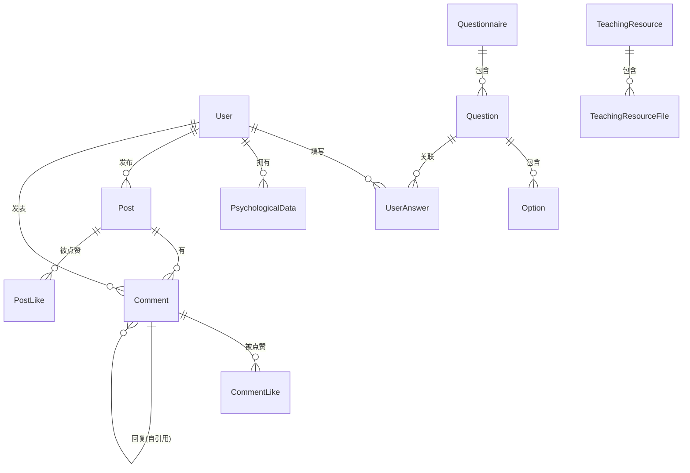

# 语文天地 —— 需求分析文档

> **项目名称：** 语文天地（Magic Cube）  
> **项目性质：** Java Web 教育辅助平台  
> **技术栈：** Spring Boot 3.2.5 + JPA/Hibernate + Thymeleaf + MySQL + DeepSeek AI

---

## 1. 项目背景与目标

### 1.1 项目背景

随着教育信息化的深入推进，初中语文教学不仅需要关注学生的学科知识掌握情况，还应关注学生的心理状态和情绪健康。"语文天地"是一个面向初中生的语文学习与心理健康辅助平台，旨在通过心理问卷评估、数据分析、AI 智能建议等功能，帮助教师及时掌握学生的心理状态，并为学生提供自我认知和情绪调节的工具。

### 1.2 项目目标

- 为学生提供一个可以进行心理自评、查看个人心理状态变化趋势、参与班级交流互动的平台。
- 为教师提供一个能够监控全班学生心理状态、识别需要关注的学生、管理教学资源的综合管理工具。
- 通过 AI 辅助分析，为师生双方提供个性化的心理建议和干预策略。

---

## 2. 受众人群

### 2.1 学生（核心用户）

| 维度 | 描述 |
|------|------|
| **年龄范围** | 12-15 岁（初中七至九年级） |
| **角色特点** | 处于青春期，面临学业压力、人际关系、自我认知等多方面挑战，需要心理支持和情绪引导 |
| **使用场景** | 课后自评心理状态、查看个人能量监测数据、在班级留言板中交流互动、查看个人学情诊断报告 |
| **技术能力** | 具备基础的计算机操作能力，能用浏览器访问网页 |

### 2.2 教师 / 管理员（管理用户）

| 维度 | 描述 |
|------|------|
| **角色特点** | 通常是班主任或心理辅导老师，需要掌握全班学生的心理动态，及时发现并干预潜在问题 |
| **使用场景** | 查看全班学生心理数据概览、识别需要预警的学生、管理教学资源库、查看 AI 智能分析报告、批量导入心理数据 |
| **核心需求** | 数据可视化、预警机制、批量操作效率 |

### 2.3 系统管理员

| 维度 | 描述 |
|------|------|
| **角色特点** | 维护系统正常运行，管理用户账号和系统配置 |
| **使用场景** | 用户管理、系统配置（如 AI 接口参数）、数据库维护 |

---

## 3. 功能需求

### 3.1 用户管理模块

#### 3.1.1 用户注册
- **描述：** 新用户可以通过注册页面创建账号，选择角色（学生/教师），填写用户名、密码、班级等基本信息
- **前置条件：** 用户名不能重复，密码长度不少于 6 位
- **后置条件：** 注册成功后自动登录并跳转至首页
- **补充说明：** 注册时可选择性填写姓名、性别、年龄、年级等信息

#### 3.1.2 用户登录
- **描述：** 已注册用户通过用户名和密码登录系统
- **前置条件：** 用户已注册
- **后置条件：** 登录成功后将用户信息存入 Session，根据角色展示不同导航
- **补充功能：** "记住我"功能可将用户名存入 Cookie（有效期 7 天）

#### 3.1.3 密码管理
- **忘记密码：** 通过用户名直接重置新密码（无需邮箱验证，适用于校内环境）
- **修改密码：** 登录状态下验证旧密码后修改为新密码
- **校验规则：** 新密码长度不少于 6 位，两次输入需一致

#### 3.1.4 个人信息管理
- **描述：** 用户可修改自己的用户名、姓名、性别、年龄、年级等信息
- **补充说明：** 修改用户名时需检查唯一性

#### 3.1.5 角色权限体系

| 角色 | 权限 |
|------|------|
| `student`（学生） | 问卷评估、能量监测、留言板、个人诊断报告 |
| `admin`（教师/管理员） | 全班数据概览、预警系统、教学资源管理、AI 干预建议、CSV 数据导入 |

### 3.2 心理问卷评估模块

#### 3.2.1 CD-RISC 心理弹性量表
- **描述：** 基于 Connor-Davidson 心理弹性量表（25 道题），评估学生心理弹性水平
- **题目类型：** 李克特 5 点量表（0 = 从来不 ~ 4 = 一直如此）
- **满分：** 100 分
- **维度：** 心理韧性（RESILIENCE）
- **常模参考：** 男性均值 70.63 ± 13.20，女性均值 68.19 ± 13.09
- **自动初始化：** 首次访问问卷页面时系统自动创建默认问卷

#### 3.2.2 干预状态追踪
- **干预前评估（PRE_INTERVENTION）：** 学生首次填写问卷时的基线数据
- **干预后评估（POST_INTERVENTION）：** 经过一段时间的关注或干预后再次评估
- **对比分析：** 系统自动计算干预前后的平均分变化

#### 3.2.3 问卷提交与评分
- **答案保存：** 用户的每道题答案和分数均持久化存储（保留历史记录，不覆盖）
- **总分计算：** 自动累加各题得分
- **维度分析：** 按维度（如 RESILIENCE）计算平均分
- **心理数据同步：** 提交后自动同步到 `psychological_data` 表，保存学生信息快照（姓名、性别、年龄、年级）

#### 3.2.4 历史记录查看
- **学生端：** 查看每次问卷提交的详细答题记录（题目、选项、得分）
- **教师端：** 可以查看指定学生的问卷详情（需权限验证）

### 3.3 能量监测模块

#### 3.3.1 学生个人能量监测
- **最新分数展示：** 显示最近的 CD-RISC 得分
- **常模对比：** 根据学生性别展示相应的常模范围（低/中/高三档）
- **干预前后对比：** 展示干预前平均分和干预后平均分的对比数据
- **历史趋势：** 按时间序列展示所有历史得分数据，支持趋势图表展示
- **状态标识：** 清晰标识最新数据是干预前还是干预后

#### 3.3.2 教师端全班数据概览
- **全班数据列表：** 展示所有学生的心理数据（仅显示学生角色，过滤非学生账号）
- **分数分布饼图：** 将分数分为 5 档（1-5 分制）展示各档次学生人数及占比
- **干预前后对比趋势：** 统计全班学生干预前和干预后的平均分
- **学生姓名加载：** 自动关联用户表获取学生的姓名

#### 3.3.3 CSV 批量数据导入
- **描述：** 教师可通过上传 CSV 文件批量导入心理数据
- **表头自动匹配：** 支持多种列名格式（中英文、多种变体），不要求列顺序
- **必需列：** user_id（用户 ID）、score（分数）、test_date（测试日期）、intervention_status（干预状态）
- **数据验证：** 自动跳过无效行并记录日志

### 3.4 学情诊断模块

#### 3.4.1 个人诊断报告
- **历史数据展示：** 展示用户所有心理数据记录
- **最新分数：** 显示最近一次的 CD-RISC 得分
- **AI 智能建议：** 调用 DeepSeek API 根据得分和建议状态生成个性化心理建议
- **降级方案：** AI 接口不可用时自动使用本地预设的评分分段建议

#### 3.4.2 全班诊断报告（仅教师）
- **学生列表：** 展示全班学生的干预前/干预后得分及变化值
- **预警名单：** 自动识别得分低于常模下限的学生，区分干预前预警和干预后预警
- **留言板词云分析：** 对全班帖子和评论进行中文分词，生成高频词统计
- **AI 动态干预建议：** 汇总班级情况发送给 AI 生成针对性建议

#### 3.4.3 干预前后对比报告
- **时间划分：** 以指定干预日期为界，分别统计前后的心理数据和留言内容
- **词频对比：** 对比干预前后的留言关键词变化

### 3.5 心理预警系统

#### 3.5.1 预警规则
| 预警类型 | 判断条件 |
|----------|----------|
| 焦虑预警 | 焦虑维度得分 > 3.5 |
| 整体状态预警 | 整体得分 < 2.5 |

#### 3.5.2 预警列表
- 自动生成需要关注的学生名单
- 显示每位学生的预警原因
- 支持从预警名单跳转到学生问卷详情

### 3.6 班级留言板模块

#### 3.6.1 帖子管理
- **发布帖子：** 学生可以发布文字内容
- **删除帖子：** 帖主或管理员可以删除
- **置顶/取消置顶：** 管理员可将重要帖子置顶
- **排序：** 支持按时间或点赞数排序

#### 3.6.2 评论与回复
- **评论：** 用户可以对帖子发表评论
- **回复：** 支持嵌套回复（引用式回复），显示被回复者的用户名
- **删除评论：** 评论作者或管理员可删除

#### 3.6.3 点赞系统
- **帖子点赞：** 用户可对帖子点赞/取消点赞
- **评论点赞：** 用户可对评论点赞/取消点赞
- **实时反馈：** 通过 AJAX 异步请求实现无刷新点赞

#### 3.6.4 词云分析
- 自动对留言板内容进行中文分词，统计高频词汇
- 用于诊断报告中的情绪关键词分析

### 3.7 教学资源管理模块

#### 3.7.1 课文资源组织
- **资源列表：** 按排序顺序展示所有课文
- **文件夹层级：** 支持多级文件夹结构（课文 → 子文件夹 → 文件）
- **文件扫描：** 自动扫描静态资源目录，同步文件结构到数据库

#### 3.7.2 文件操作（仅教师）
- **上传文件：** 向指定目录上传本地文件
- **下载文件：** 从浏览器下载资源文件
- **创建文件夹：** 在线创建子文件夹
- **删除文件/文件夹：** 递归删除文件和数据库记录

#### 3.7.3 文件分类
| 文件类型 | 说明 |
|----------|------|
| `lesson_plan` | 教案 |
| `teaching_guide` | 教学目标与引导建议 |
| `script` | 教学剧本 |
| `video` | 教学视频 |
| `folder` | 文件夹 |
| `document` | 普通文档 |

### 3.8 AI 智能分析模块

#### 3.8.1 技术实现
- **API 对接：** 通过百度千帆平台调用 DeepSeek-V3 大模型
- **异步处理：** 使用 `CompletableFuture` 实现非阻塞 AI 建议生成
- **配置化：** API Key、URL、模型名称均通过配置文件管理

#### 3.8.2 AI 功能列表
| 功能 | 触发场景 | 输出 |
|------|----------|------|
| 个性化心理建议 | 个人诊断报告页面 | 100-200 字温暖鼓励性建议 |
| 详细心理分析报告 | 深入分析需求 | 300-500 字多维度分析报告 |
| 班级干预建议 | 全班诊断报告 | 基于班级数据的汇总建议 |

#### 3.8.3 降级机制
当 AI API 不可用时（网络异常、接口限流等），系统自动切换到本地预设的评分分段建议，确保功能不中断。

### 3.9 词云分析模块

#### 3.9.1 技术实现
- **分词引擎：** 使用 HanLP 进行中文分词
- **停用词过滤：** 内置停用词表，过滤无意义的虚词和标点
- **词频统计：** 统计每个关键词出现的次数，按频次降序排列

#### 3.9.2 应用场景
| 场景 | 数据来源 | 用途 |
|------|----------|------|
| 个人诊断报告 | 该学生的帖子内容 | 了解个人情绪关键词 |
| 全班诊断报告 | 全班帖子和评论 | 掌握班级整体情绪倾向 |
| 干预对比报告 | 干预前后的分别统计 | 评估干预效果 |
| 词云 API | 所有帖子 | 供前端词云组件渲染 |

---

## 4. 非功能需求

### 4.1 性能需求
- 页面加载时间不超过 3 秒（正常网络环境）
- AI 建议生成支持异步调用，不阻塞页面渲染
- CSV 导入支持批量数据（建议单次不超过 5000 行）

### 4.2 安全需求
- 用户密码以明文存储（当前实现，建议后续升级为哈希加密）
- Session 管理用户登录状态，登出时销毁 Session
- 教师端功能需校验角色权限
- 学生只能查看自己的数据，教师只能管理学生角色的数据

### 4.3 可用性需求
- 界面简洁友好，适合初中生使用
- 注册、登录、问卷填写等核心操作流程不超过 3 步
- 支持移动端基本访问（响应式待完善）

### 4.4 可维护性需求
- 使用 Maven 管理依赖
- AI 接口配置（API Key/URL/模型）集中在配置文件中，修改无需改代码
- 数据库表结构通过 JPA 自动维护（ddl-auto=update）

### 4.5 兼容性需求
- 支持主流浏览器（Chrome、Edge、Safari、Firefox）
- 服务端编码 UTF-8，支持中文字符
- 数据库字符集 utf8mb4，支持 emoji 和特殊字符

---

## 5. 数据实体关系

### 5.1 实体一览

| 实体 | 对应表 | 说明 |
|------|--------|------|
| User | `users` | 用户账号信息（学生/教师） |
| Questionnaire | `questionnaires` | 问卷定义 |
| Question | `questions` | 问卷中的题目 |
| Option | `options` | 题目的选项及分值 |
| UserAnswer | `user_answers` | 用户答题答案 |
| PsychologicalData | `psychological_data` | 心理评估数据汇总 |
| Post | `posts` | 留言板帖子 |
| Comment | `comments` | 留言板评论 |
| PostLike | `post_likes` | 帖子点赞记录 |
| CommentLike | `comment_likes` | 评论点赞记录 |
| TeachingResource | `teaching_resource` | 教学资源分类 |
| TeachingResourceFile | `teaching_resource_file` | 教学资源文件 |

### 5.2 核心业务关系



---

## 6. 用户使用流程

### 6.1 学生使用流程

```
注册/登录 → 首页
  ├─ 心理问卷评估 → 完成 CD-RISC 25 题 → 查看得分与常模对比
  ├─ 能量检测窗 → 查看历史趋势、干预前后对比
  ├─ 学情诊断报告 → 查看心理数据记录 + AI 智能建议
  ├─ 班级留言板 → 发帖、评论、回复、点赞
  └─ 个人资料管理 → 修改密码、修改个人信息
```

### 6.2 教师使用流程

```
登录 → 首页
  ├─ 全班数据概览 → 查看分数分布、干预对比趋势、数据明细
  ├─ 学情诊断报告（全班） → 学生列表、预警名单、词云分析、AI 建议
  ├─ 教学资源库 → 管理课文文件、上传/下载/删除
  ├─ CSV 导入 → 批量导入学生心理数据
  └─ 班级留言板 → 管理帖子（置顶/删除）
```

---

## 7. 项目状态与遗留问题

### 7.1 当前已实现
- ✅ 用户注册/登录/密码管理/个人信息管理
- ✅ CD-RISC 25 题心理问卷（含答案保存、评分、历史记录）
- ✅ 干预前/干预后状态追踪与对比分析
- ✅ 个人与全班能量监测面板（含趋势图、分布图）
- ✅ 班级留言板（发帖、评论、回复、点赞、置顶）
- ✅ 学情诊断报告（个人 + 全班）
- ✅ 心理预警系统
- ✅ 教学资源管理（文件夹层级、上传/下载/扫描）
- ✅ AI 智能建议（DeepSeek + 百度千帆）
- ✅ 词云分析（HanLP 分词）
- ✅ CSV 批量导入

### 7.2 待优化建议
- ⏳ 密码应使用哈希加密存储（当前为明文）
- ⏳ 邮箱/手机号验证找回密码
- ⏳ 前端 UI 响应式适配（移动端访问）
- ⏳ 问卷题目支持动态编辑（目前仅支持代码初始化）
- ⏳ 数据导出为 Excel/PDF 报告
- ⏳ 多班级/多教师支持
- ⏳ 系统操作日志记录

---

*本文档基于 Magic Cube 项目源码反向分析生成，反映了当前已实现的功能及其背后的需求设计。*
